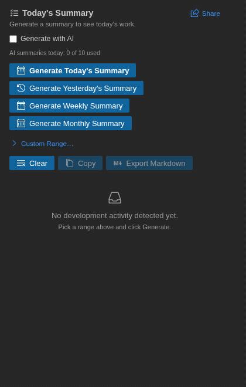
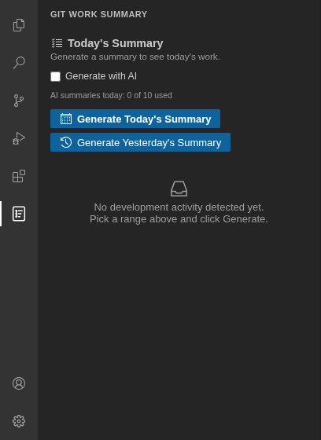

# Git Standup – AI Work Summary

Turn your day's Git activity into ready-to-paste summary bullets — for standups, status updates, weekly reports, or your own work log. Runs entirely on your machine by default: no account, no cloud, nothing to configure beyond installing it.

## What it does

Git Standup reads your commits, staged/unstaged changes, and recently edited files, then turns them into a clean, categorized bullet list in seconds — so you're not stuck remembering (or writing up) what you did. Tick the optional **Generate with AI** checkbox for richer, per-commit descriptions and AI-drafted commit messages, powered by [Groq](https://groq.com) — bring your own free API key.

## Use cases

- **Daily standups** — generate today's summary in one click right before your morning standup.
- **Weekly / sprint reports** — roll up the last 7 or 30 days, or any custom date range.
- **Performance reviews & self-assessments** — export a clean, dated record of what you shipped over any period.
- **Timesheets & work logs** — a factual, timestamped account of your commit and file activity.
- **Commit messages** — draft a clear, well-formed commit message from your uncommitted diff instead of writing one from scratch.

## Setup

1. Install **Git Standup – AI Work Summary** from the VS Code Extensions view (search "Git Standup"), or via a `.vsix` file.
2. Open a folder or workspace — a Git repository is recommended, but not required.
3. Click the **Git Standup** icon in the Activity Bar to open the panel.

That's it — no accounts and no configuration needed. Everything works locally out of the box.

**Optional: turn on AI-enhanced summaries**

1. Tick the **Generate with AI** checkbox in the panel.
2. Paste a free [Groq API key](https://console.groq.com/keys) when prompted — it's stored securely in VS Code's encrypted Secret Storage, never in settings or source code.
3. AI-enhanced summaries are limited to 10 per day (resets at midnight); untick the checkbox anytime to go back to fully local, unlimited generation.

## How to use

1. Open the **Git Standup** panel from the Activity Bar.
2. Click **Generate Today's Summary**, **Generate Yesterday's Summary**, **Generate Weekly Summary**, or **Generate Monthly Summary** — or click **Custom Range…** to reveal a start/end date picker and **Generate Custom Summary**.
3. Click **Copy** to copy the summary as plain text, or **Export as Markdown** to save it as a file.
4. Click **Clear** to reset the panel before generating again.
5. If you have uncommitted changes and an AI key is set up, a **Generate Commit Message** button appears — click it to draft a commit message from your actual diff. It's inserted directly into Source Control, and also shown in the panel with its own **Copy** button so you can grab it anytime.
6. Open the **Detected Changes** view below the summary to see exactly which commits and files were found, grouped by category.
7. Click **Share** in the panel header anytime to copy a link to the extension or open its Marketplace page.

## Privacy

Nothing leaves your machine unless you explicitly turn on **Generate with AI** or click **Generate Commit Message** — and even then, only your commit messages/diffs are sent to Groq over HTTPS. No telemetry, ever.

## Author

Mahir Patel — [mahirpatel9765@gmail.com](mailto:mahirpatel9765@gmail.com)

## License

[MIT](LICENSE)

## Changelog

See [CHANGELOG.md](CHANGELOG.md).
